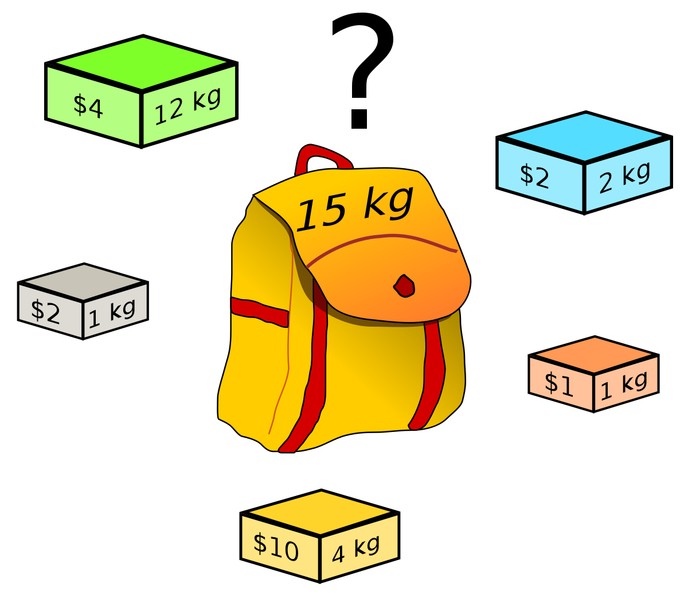

## Knapsack

Week 2 Assignment of the Coursera Course [Discrete Optimization](https://www.coursera.org/learn/discrete-optimization/home/info).  
This code can get full score **60/60** for the assignment.  
The implementation is written in C++17, the `solver.py` will feed data into the C++ program and get result back from it.  
To run the program you need to compile `main.cpp`, here I use choose as my compiler:

`$ clang++ main.cpp -o main -std=c++17 -O2 -Wall`

This will generate executable file `main`, then you can run `submit.py` to submit the result:

`$ python submit.py`

### Optimization Strategy

* Prune and Bound
* Greedy Search
* BackTrack
